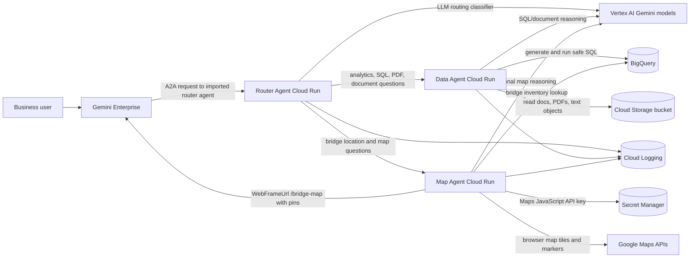
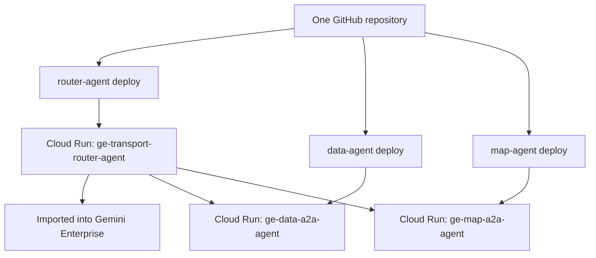

# Multi-Agent Project Architecture

This repository contains three deployable A2A/ADK agents. Each agent has its own
folder and should be deployed as its own Cloud Run service.

## High-Level Diagram



## Cloud Run Services

| Service | Folder | Purpose | Main features |
| --- | --- | --- | --- |
| Router agent | `router-agent/` | Single front door imported into Gemini Enterprise | A2A server, ADK agent, LLM classifier, remote A2A calls to specialist agents |
| Data agent | `data-agent/` | Data and document Q&A | BigQuery tables, Cloud Storage bucket, PDF/text reading, SQL generation controls |
| Map agent | `map-agent/` | Bridge map and location Q&A | BigQuery bridge inventory, A2UI `WebFrameUrl`, Cloud Run `/bridge-map`, Google Maps JavaScript pins |

## Runtime Flow

1. User asks a question in Gemini Enterprise.
2. Gemini Enterprise sends the request to the imported router agent card URL.
3. Router agent uses an LLM classifier to choose the best specialist:
   - Data agent for BigQuery analytics, table counts, SQL answers, PDF/manual
     questions, and Cloud Storage document questions.
   - Map agent for bridge location lookup, map display, coordinates, and visual
     bridge inventory questions.
4. Router calls the selected specialist agent over A2A.
5. Specialist agent queries BigQuery, Cloud Storage, Google Maps, or Gemini as
   needed.
6. Specialist response returns through the router to Gemini Enterprise.
7. Gemini Enterprise renders the answer. For map results, it renders a
   `WebFrameUrl` that loads the map-agent `/bridge-map` page with bridge pins.

## Feature Matrix

| Feature | Router agent | Data agent | Map agent |
| --- | --- | --- | --- |
| Gemini Enterprise import | Yes, import this one | Optional/direct testing only | Optional/direct testing only |
| A2A protocol | Yes | Yes | Yes |
| ADK agent | Yes | Yes | Yes |
| LLM routing/classification | Yes | No | No |
| BigQuery access | No direct data query | Yes, multiple configured tables | Yes, bridge inventory table |
| Cloud Storage access | No | Yes, bucket docs/PDFs/text | No |
| PDF reading | No | Yes, with size/page/text limits | No |
| A2UI rendering | Pass-through from specialist | Optional text/table style response | Yes, `WebFrameUrl` map response |
| Google Maps display | No | No | Yes, interactive pins |
| Secret Manager | Usually no | Optional | Yes, Maps API key |
| Cloud Logging | Yes | Yes | Yes |

## Project Folder Layout

```text
want-to-create-a-a2a-adk/
  router-agent/
    orchestrator_router/
      agent.py              # Router ADK agent
      classifier.py         # LLM-based routing classifier
      remote_agents.py      # A2A clients for data/map agents
      main.py               # Cloud Run app entrypoint
    cloudrun-env.example.yaml
    scripts/

  data-agent/
    data_a2a_agent/
      agent.py              # Data/PDF/BigQuery ADK agent
      config.py             # BigQuery, GCS, PDF, model limits
      main.py               # Cloud Run app entrypoint
    cloudrun-env.example.yaml
    scripts/

  map-agent/
    app/
      agent.py              # Bridge inventory ADK agent
      bridge_tools.py       # BigQuery bridge search and map pin data
      bridge_ui.py          # A2UI WebFrameUrl payload builder
      main.py               # A2A app plus /bridge-map map page
    cloudrun-env.example.yaml
    scripts/
```

## Recommended Model Use

| Agent | Recommended model | Reason |
| --- | --- | --- |
| Router agent | Fast Gemini model | Short classification and routing decisions |
| Data agent | Stronger Gemini model for complex SQL | Better SQL planning, table reasoning, PDF summarization |
| Map agent | Fast Gemini model | Most map work is deterministic BigQuery lookup plus UI rendering |

Use the model IDs supported by your Vertex AI project and location. If a model
requires the global Vertex endpoint, set `GOOGLE_CLOUD_LOCATION: "global"` in
that agent's Cloud Run environment.

## Deployment Shape



This structure gives clean separation at runtime while keeping development in
one repo. Each Cloud Run service can scale, log, deploy, and fail independently.

